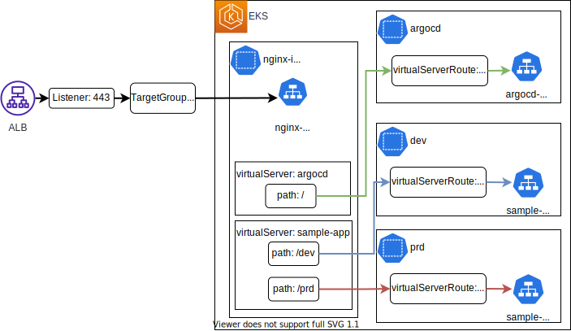

# ArgoCD CICD

- [ArgoCD CICD](#argocd-cicd)
  - [Purpose](#purpose)
  - [Requirements](#requirements)
  - [Basic Policy](#basic-policy)
  - [Overall Architecture](#overall-architecture)
  - [GitHub](#github)
    - [Guildelines](#guildelines)
  - [CICD Pipeline](#cicd-pipeline)
    - [Outline image](#outline-image)
    - [Governance](#governance)
    - [Role](#role)
      - [Branch strategy](#branch-strategy)
    - [GitHub Events and CICD jobs](#github-events-and-cicd-jobs)
      - [GitHub Events](#github-events)
    - [CICD Jobs](#cicd-jobs)
      - [Update K8s manifest](#update-k8s-manifest)
    - [CICD Jobs Trriged by GitHub Event](#cicd-jobs-trriged-by-github-event)
  - [ArgoCD](#argocd)
    - [Guidelines](#guidelines)
    - [Project](#project)
    - [ApplicationSet](#applicationset)
    - [User and RBAC](#user-and-rbac)
  - [Terraform](#terraform)
    - [Guidelines](#guidelines-1)
  - [Internet Access](#internet-access)
    - [Guidelines](#guidelines-2)
  - [References](#references)

## Purpose

以下の技術スタックを用いて、CICDパイプラインを構築する例を述べる。

- VCS: GitHub (free版を前提とする。)
- クラウド: AWS
- デプロイ先: K8s (EKS)

全体像としては以下の通りである。


## Requirements

- インフラストラクチャの構築・CICDパイプラインの動作は可能な限り自動化すること。
  - 人的介入を減らし、運用負荷を削減するため。
- 本番環境と開発環境を用意し、想定されるアクターに対し適切な認証・認可を設定すること。
  - アプリケーションリポジトリの主要ブランチへのMergeには開発責任者の承認を要する。
  - K8sマニフェストリポジトリへの主要ブランチへのMergeは運用者の承認を要する。
  - 開発者・開発責任者者は開発環境に対して自由にデプロイを行える。
  - 本番環境のデプロイには運用者の承認を必要とする。
- アクターは以下の通り
  | アクター                      | 説明                                                                       |
  | :---------------------------- | :------------------------------------------------------------------------- |
  | 開発者 (developer)            | アプリケーションリポジトリで開発を行う。主要ブランチへのPR要求を行う。     |
  | 開発責任者 (developer leader) | アプリケーションレポジトリでの開発を行う。主要ブランチへのPRや承認を行う。 |
  | 運用者 (operator)             | インフラストラクチャの管理や、本番環境へのデプロイを行う。                 |

## Basic Policy

- インフラストラクチャはTerraformを用いてコード化する。
  - テスト環境のため、TerraformのCICDは実装しない。
- EKS上の環境分けは名前空間で行う。
  - 実際の運用の際はクラスタで分けることを推奨。
- CI/CDツールとしてはCIはGitHub Actionsを、CDはArgoCDを用いる。
  - CI: VCSにGitHubを用いるため、実装が簡単なため。
  - CD: デプロイ先のK8sに対して採用実績が多く、利用・運用が比較的簡単なため。

## Overall Architecture

利用するプロダクトを以下にまとめる。

| 分類                | リソース名         | 利用目的                           |
| :------------------ | :----------------- | :--------------------------------- |
| GitHub              | organization       | 本プロジェクトのリソースの一括管理 |
| GitHub/organization | team               | ユーザーのグルーピングと認可       |
| GitHub/organization | Application        | CICD用トークンの発行               |
| GitHub              | Actions            | CI                                 |
| AWS                 | EKS                | K8sクラスタ                        |
| AWS                 | SSM ParameterStore | 資格情報等の保存                   |
| AWS/EKS             | ArgoCD             | CD                                 |

## GitHub

GitHubの概要を説明する。

### Guildelines

- チーム管理のためにOrganizations機能を用いる。
- アクターに対応したチームを用意する。
  - developer: 開発者
  - developer-leader: 開発責任者
  - operator: 運用者
- アプリケーション用リポジトリとK8sマニフェストリポジトリを分割する。
  - 主にガバナンスのため[argocd-bestpractices]。
- CICD中でのリポジトリ相互参照のために、 GitHub Appsを作成する。
  - マシンユーザーの代替になる[zenn-github-apps]。
- ArgoCDのSSO機能のために、 OAuth Appsを作成する。
  - ユーザー管理をArgoCDするのは運用負荷が高い。
  - CICDパイプライン全体での権限統制が簡単になる。
- ガバナンスのために、適切なブランチ保護を適用する
  - 従来のGitフローに基づいた権限設定はもちろんのこと、CICDではデプロイ先環境も加味して権限設定を行うこと。

## CICD Pipeline

CICDパイプラインの概要を説明する。

### Outline image

以下図にCICDの概要図を示す。


ポイントは以下の通り。

- GitHub Organizationとして `toyamagu-cicd-example` を用意する。
- `toyamagu-cicd-example` の下に以下の3つのリポジトリを用意する。
  - `terraform-github`
    - Terraform用のリポジトリ
  - `argocd-cicd-application`
    - アプリケーション用のリポジトリ
  - `argocd-cicd-k8s-manifest`
    - K8sマニフェスト用のリポジトリ
    - アプリケーション用K8sマニフェスト
    - EKSブートストラップ用K8sマニフェスト
- アプリケーションリポジトリのコミット、PRなどのGitHubイベントをトリガーとしてCICDパイプラインをトリガーする。
  - CIでは以下を行う。
    - コンテナイメージのビルド
    - K8sマニフェストのアップデート
  - CDでは以下を行う。
    - EKSクラスタへのデプロイ

### Governance

CICDを採用すると、アプリケーションリポジトリでのMergeが実環境でのデプロイに繋がるため、CICD全体を通して権限統制を行う。

### Role

各リポジトリに対してアクターにロールを付与することで、認可を行う。  
GitHubでデフォルトで存在するロールと、権限の概要は以下の通り[github-role]。  
有料Enterprise版ではカスタムロールを作成することができる。

| ロール   | 権限                         |
| :------- | :--------------------------- |
| Read     | 読み取り専用                 |
| Triage   | issueやPR                    |
| Write    | push                         |
| Maintain | 運用(一部の危険な操作を除く) |
| Admin    | 運用(全て)                   |

#### Branch strategy

ブランチ戦略を定める。  
一般に、ブランチ戦略を複雑にすればするほど細かい権限分割が可能になる。  
一方で、認知負荷・運用負荷は上昇する。明確な理由を伴わない複雑さは、生産性を大きく損ねる。  
組織として必要なガバナンス要件を会話し、バランスの良い意思決定を行うことが重要である。  
本リポジトリでは以下のように定める。

- アプリケーションリポジトリ
  - 機能実装のための一時ブランチと、デプロイ先環境に対応した環境ブランチの2種類に分ける。デプロイ先環境は簡単のため本番・開発のみを仮定する。
      1. 一時ブランチ
          - Merge後削除されるブランチ
      1. 環境ブランチ
          - デプロイ先環境に対応するブランチ。環境ブランチへのMergeは各環境へのデプロイに対応するとみなす。
          - そのため、ブランチの保護を適用し、フローに対して適切なガバナンスを定めること。
  - 環境ごとにブランチを分けるのは、DB設定を書き分けるなどの、環境差分を吸収するためでは**ない**。適切な環境で適切なCICD・統合テストを行った後、本番リリースを行うための処方である。
    - 環境差分は全て設定ファイルとして外出しし、適切な方法でアプリケーションにマウントする[12factor-three]。
    - K8sであればConfigMapやSecret機能を用いる。
- K8sマニフェストリポジトリ
  - 本番環境用のマニフェストと、本番環境以外のマニフェストを格納するブランチに分ける。要件に応じて必要であれば細かく分割する。
      1. 本番環境用マニフェストを格納するブランチ
        - CDツール（ArgoCD）が本番環境のデプロイするマニフェストを保管する。
        - 運用者のみが書き込み権限を持つ。
      1. 本番環境以外のマニフェストを格納するブランチ
        - CDツールが本番環境以外の環境に対しデプロイするマニフェストを保管する。
        - デプロイをさらに統制したい場合などは、環境毎にブランチを分けても良いが、不必要な複雑さと判断する。反映漏れなどのデプロイ事故のもとにもなる。
        - 環境差分は `kustomize` を用いて吸収する[kustomize]。
        - 開発者・開発責任者・運用者が書き込み権限を持つ。

上記の指針に基づき、以下のようにアクター・ロールを設定する。  
GitHubのブランチ保護設定で、Merge可能なロールをMaintainのみに制限したり、Organizationの特定グループ・ユーザーのみに制限したりにできる。  
GitHub Organization Freeではユーザーグループ毎の細かい権限制御ができないため、Enterprise版に比べてだいぶ粗いものになっている。必要に応じて細分化を検討する。

| リポジトリ                 | ブランチ | 役割                                                  | Merge可能なロール |
| :------------------------- | :------- | :---------------------------------------------------- | :---------------- |
| アプリケーションリポジトリ | `main`   | 本番環境にリリースされるコードが格納される。          | Maintain          |
|                            | `dev`    | 開発環境にリリースされるコードが格納される。          | Write             |
| K8sマニフェストリポジトリ  | `main`   | 本番環境にデプロイされるK8sマニフェストが格納される。 | Maintain          |
|                            | `dev`    | 開発環境にデプロイされるK8sマニフェストが格納される。 | Write             |

| アクター         | リポジトリ                 | ロール   | 説明                                                                 |
| :--------------- | :------------------------- | :------- | :------------------------------------------------------------------- |
| developer        | アプリケーションリポジトリ | Write    | 開発環境ブランチへの `push` や、本番環境ブランチへの PR を行うため。 |
| developer leader | アプリケーションリポジトリ | Maintain | 本番環境ブランチのPRを承認するため。                                 |
| Operator         | アプリケーションリポジトリ | Maintain | 本番環境ブランチのPRを承認するため。                                 |
| developer        | K8sマニフェストリポジトリ  | Write    | 開発環境ブランチへの `push` や、本番環境ブランチへの PR を行うため。 |
| developer leader | K8sマニフェストリポジトリ  | Write    | 開発環境ブランチへの `push` や、本番環境ブランチへの PR を行うため。 |
| Operator         | K8sマニフェストリポジトリ  | Maintain | 本番環境ブランチのPRを承認し、CDツールを利用したデプロイを行うため。 |

### GitHub Events and CICD jobs

本節ではCICDをトリガーするGitHub Eventsと、Eventに対応するCICDジョブを記述する。

#### GitHub Events

以下に今回用いるGitHub Eventをまとめる。  
他にもTag生成などがメジャーである。

| Event                          | 説明                                                                       |
| :----------------------------- | :------------------------------------------------------------------------- |
| Pull Request (PR)              | 対象ブランチへの merge 要求を行い、責任者がレビューする。 |
| Merged (puth to target branch) | PRを承認し、mergeを行う。Merge対象ブランチへの書き込み権限が必要。         |

### CICD Jobs

以下に主要なCI/CDのジョブをまとめる。

| Job                 | 説明                                                                                     |
| :------------------ | :--------------------------------------------------------------------------------------- |
| Build               | アプリケーションのビルドを行う。必要に応じて結果を保管する。                             |
| Test                | アプリケーションのテストを行う。必要に応じてテスト結果を保管し、PRにフィードバックする。 |
| Publish             | ライブラリやコンテナイメージをアーティファクトリポジトリにパブリッシュする。             |
| Update K8s manifest | コンテナタグのハッシュ値書き換えなど、K8sマニフェストのアップデートを行う。              |

#### Update K8s manifest

K8sマニフェストリポジトリの書き換えの際、直接 push するか PR するかという選択肢があるが、以下のようにする。

- `dev` ブランチ
  - PRを都度Mergeするのは開発効率を下げるため、CI中で `dev` ブランチに直接 push することを許可する。
- `prd` ブランチ
  - 本番環境にデプロイされるため、CI中でPRを作成し、開発責任者がレビュー・運用者が承認するフローとする。

### CICD Jobs Trriged by GitHub Event

CICDジョブはGitHub Eventによりトリガーされ、Eventの性質ごとにトリガーされるジョブが異なる。  
大方針を以下にまとめる。

- Pull Request
  - Merge 責任者がレビューし、PRを承認する。この際の助けになるよう、自動テストや自動ビルドを実行する。
  - 必要に応じてテストカバレッジをPRに表示する。
  - 特定テストが成功しないとMergeできないなどの設定ををすることも可能。
- Merged
  - PR通過後、Mergeを行う。
  - 自動的にデプロイがされるように、アーティファクトのパブリッシュやK8sマニフェストの書き換えなどを行う。

上記を以下表にまとめた。

| Event        | Job                 |
| :----------- | :------------------ |
| Pull Request | Build               |
|              | Test                |
| Merged       | Publish             |
|              | Update K8s manifest |

## ArgoCD

ArgoCDの概要を説明する。

### Guidelines

- ArgoCDデプロイ
  - ArgoCDはTerraformコードに含め、EKSクラスターのプロビジョニング時に自動的にデプロイする。
    - インストールを自動化することにより、運用負荷を下げるため。
    - ArgoCDはインフラに近い部分のため、クラスターのブートストラップに含めると後の必要リソースのプロビジョニングが容易になるため。
- アプリケーションデプロイ
  - ApplicationSetを利用し、GitHubリポジトリの特定プレフィックスに対して一括したデプロイを行う。
    - Git Generatorを用いる[argocd-applicationset-git-generator]。
  - Applicationのデプロイに利用するProject (`spec.template.spec.project`) は可能な限りハードコーディングすること。
    - 権限の強いProjectの不正利用を防ぐため[argocd-applicationset-git-generator]。
  - クラスターの稼働に必須のK8sコンポーネントは `bootstrap` ApplicationSetを作成し、デプロイする。
    - 幅広いNSにデプロイするため、開発者は利用不可とする。そのため、 `targetRevision` は `main` ブランチとする。
  - 開発者がデプロイするアプリケーションは `dev`, `prd` ApplicationSetを作成し、デプロイする。
    - 各環境に対応するNSにデプロイするため、 `targetRevision` はデプロイ先に応じて適切に設定する。
      - NS: `dev` -> `targetRevision`: `dev`
      - NS: `prd` -> `targetRevision`: `main`
- ArgoCD Project
  - Proect機能を用いてApplicationのデプロイ先NSを制限する。
- 認証・認可
  - ユーザー管理を楽にするため、認証にはArgoCD Dexを利用する。GitHubと連携を行う。
  - ArgoCD RBAC機能を用いて、認可を行う。
  - RBAC設定概要 (簡単のためAppliaction関連のみ記述する)
    - 読み取り
      - すべてのリソースの読み取りを全ユーザーに許可
    - `create`, `overwride`, `update`
      - 全てのリソースを宣言的に作成するため、開発者にコンソールからのApplication作成・更新を許可しない。
      - ApplicationSetで指定した監視先Gitディレクトリのみデプロイ可能とする。
    - `sync`, `exec`
      - 開発環境では開発者以上に許可。
      - 本番環境では運用者のみに許可。

### Project

ArgoCDではProject機能を用いて、デプロイ先NSやクラスター、デプロイ可能なリソースを制限できる。
今回は以下のようなポリシーで設定する。

1. `bootstrap` Project
    - クラスターの bootsrap に用いるProject
    - `argocd` や `nginx-ingress` 等、bootstrapに必要なNSを許可する。
1. `prd` / `dev` Project
    - 本番環境 / 開発環境 へのアプリケーションデプロイに利用するProject
    - それぞれ `prd` / `dev` NSへのデプロイを許可する。

### ApplicationSet

Applicationをまとめて管理する方法として、App of Appsパターンが用いられてきた[app-of-apps]。  
ただし、デプロイ先のプロジェクトを事実上制限できないことや[^application]、多くのパスに対してデプロイするのが大変など、問題点もあった。
ArgoCD v2.3からデフォルトインストールに含まれた、ApplicationSet[applicationset]はこれらの問題をある程度解決する。  

以下のように3つのApplicationSetを用意し、用途ごとにwatch先、deploy先projectを使い分ける。

1. `bootstrap` AppliactionSet
    - クラスターのbootstrapに必要なリソースをデプロイするApplicationSet
      - Nginx Ingress
    - 様々なNSにデプロイするため、強い権限を持った `bootstrap` Projectを用いる。
    - そのため、 `main` ブランチをGitOpsのソースとし、変更に運用者の承認を必要とする。
1. `prd` / `dev` AppliactionSet
    - 本番/開発環境にアプリケーションをデプロイするApplicationSet
    - 各環境に応じた `prd` / `dev` Projectにデプロイする。
    - 本番/開発環境は、`main` / `develop`ブランチをGitOpsのソースとする。


### User and RBAC

認証・認可はGitHubのOAuth機能とArgoCD Dexを連携して設定する。ブランチ戦略も絡むため、CICDガバナンスで一括して述べる。
ArgoCDでは以下のようにRBAC設定を行う。

- GitHubグループにロールを紐づける
- ロールにpermissionを設定する

以下であれば、`developer-leader` teamがAppliactionに対する `sync` と、Podに対する `exec` が可能になる。

```csv
g, ${github_org}:developer-leader, role:developer
p, role:developer, applications, sync, dev/*, allow
p, role:developer, exec, create, dev/*, allow
```

## Terraform

### Guidelines

- 運用負荷軽減のため、可能な限り全てのリソースをTerraformで作成する。
  - Terraform作成不可は以下
    - GitHub
      - User
      - Organization
      - OAuth Apps
      - GitHub Apps
- バックエンドにはS3を採用する

## Internet Access

### Guidelines

- AWS Ingress Controller[aws-lbc]を用いたALBのプロビジョニングは利用しない
  - インフラストラクチャのプロビジョニングはTerraformに一任するため
  - K8sリソースのライフサイクルと、AWSインフラのライフサイクルが一致しないため、扱いにくいため
    - 例えばMulti Cluster構成時に不便
- ALBはTerraformで作成する
- IngressとしてNginx Ingress Controllerを採用する。
- ALBターゲットグループとNginx Ingress Controller Serviceの紐づけは以下の2パターンから選択する。今回は簡単のため2.とする。
    1. AWS Ingress ControllerのTargetGroupBinding[aws-lbc-tgb]を用いて、TargetGroupとK8s serviceを紐づける
        - (pros) 動的にTargetGroupを複数サービスに指定できる。今回はNginxIngressController
        - (cons) 追加でAWS IngressControllerをデプロイする必要あり
        - (cons) K8sリソースにTargetGroupのarnを渡す必要あり
    1. ALB TargetGruopでNginxIngressControllerのNodePortを指定する。
        - (pros) 追加リソースなし
        - (cons) NginxIngressControllerをNodePortでデプロイする必要があるため、セキュティホールとなる。
        - (cons) NginxIngressControllerしか外部公開できない
- Nginx Ingress Controllerでのルーティングの際はvirtualServerとvirtualServerRouteに分割する。
  - 開発者が利用するNSを最小限に抑えるため[thinkit-nginx-ingress]。
  - 運用者が `nginx-ingress` NS にvirtualServerを作成し、virtualServerRouteへのルーティングを設定する。
  - 開発者がアプリケーションが存在するNSでvirtualServerRouteを作成し、各アプリケーションへのルーティングを行う。



## References

[github-role]: https://docs.github.com/en/organizations/managing-access-to-your-organizations-repositories/repository-roles-for-an-organization
[12factor-three]: https://12factor.net/config
[kustomize]: https://kustomize.io/
[argocd-applicationset-git-generator]: https://argo-cd.readthedocs.io/en/stable/operator-manual/applicationset/Generators-Git/
[argocd-bestpractices]: https://argo-cd.readthedocs.io/en/stable/user-guide/best_practices
[zenn-github-apps]: https://zenn.dev/tatsuo48/articles/72c8939bbc6329
[app-of-apps]: https://argo-cd.readthedocs.io/en/stable/operator-manual/cluster-bootstrapping/#app-of-apps-pattern
[applicationset]: https://argo-cd.readthedocs.io/en/stable/operator-manual/applicationset/
[aws-lbc]: https://kubernetes-sigs.github.io/aws-load-balancer-controller/
[aws-lbc-tgb]: https://kubernetes-sigs.github.io/aws-load-balancer-controller/v2.4/guide/targetgroupbinding/targetgroupbinding
[thinkit-nginx-ingress]: https://thinkit.co.jp/article/18771
[^application]: この問題は、ArgoCD v2.5以降ではNamespaced App機能により改善される見込みだが、まだalpha featureである。
