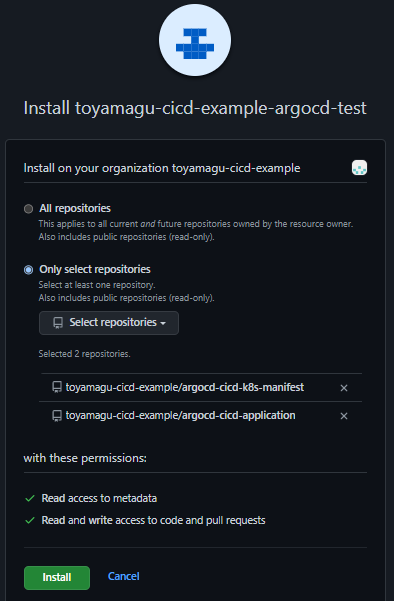
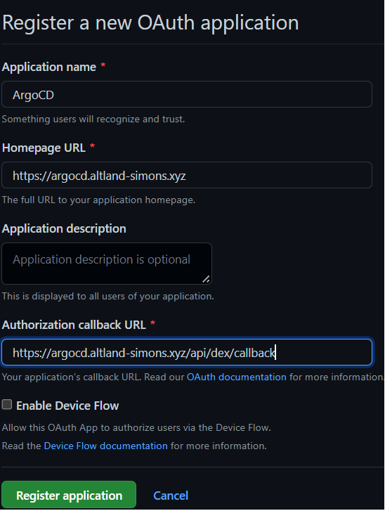

# GitHub設定手順

- [GitHub設定手順](#github設定手順)
  - [GitHub Apps](#github-apps)
  - [OAuth Apps](#oauth-apps)

## GitHub Apps

1. GitHub App作成・秘密鍵生成
    1. Organization -> Settings -> Developer settings -> GitHub Apps
    1. New GitHub App
    1. 情報入力してApp作成
        - `GitHub App name`: 任意( `toyamagu-cicd-example-argocd` )
        - `Homepage URL`: 任意( `https://github.com/organizations/toyamagu-cicd-example` )
        - `Webhook`: Activeのチェックを外す
        - `Repository Premissions`
          - `Contents`: `Read and Write`
          - `PullRequest`: `Read and Write`
    1. 遷移後の画面で `Generate Private Key`。
1. Repository作成
    1. `resources/repositories` に移動
    1. 秘密鍵をTerraformディレクトリにコピー
    1. `example.auto.tfvars` を作成して自分の環境用に編集
        - GitHubリポジトリを作成するか選択できる(デフォルトは作成)。
        - `repository_secrets`, `organization_secrets_from_file` は一旦コメントアウト
    1. `export GITHUB_TOKEN=<GITHUB_TOKEN>` としてGitHubトークンを設定
        - 十分な権限を持ったトークンを用意すること。
    1. `terraform init -backend-config=backend-config.hcl`
    1. `terraform plan`
    1. `terraform apply`
1. GitHub Appインストール
    1. Organization -> Settings -> Developer settings -> GitHub Apps -> <your_organization> Edit
    1. Install App -> <your_organization> -> Install
    1. 対象リポジトリ(アプリケーションリポジトリ・K8sマニフェストリポジトリ)へインストール
       
1. Secrets登録
    1. `example.auto.tfvars` にSecrets情報を記入
    1. `terraform plan`
    1. `terraform apply`

## OAuth Apps

1. OAuth App作成・トークン作成
    1. Organization -> Settings -> Developer settings -> OAuth Apps
    1. New OAuth App
    1. 情報入力してApp作成
       
       - `Application name`: 任意 ( `ArgoCD` )
       - `Homepage URL`: ArgoCDのURL ( `https://argocd.altland-simons.xyz` )
       - `Authorization callback URL`: ArgoCDのCallBackURL ( `https://argocd.altland-simons.xyz/api/dex/callback` )
    1. Generate New Client Secretでクライアントシークレット作成・メモ
       
1. 資格情報保存
    1. `resources/argocd` に移動
    1. `example-vaults.auto.tfvars` を作成して `client_id` と `client_secret` を記入
